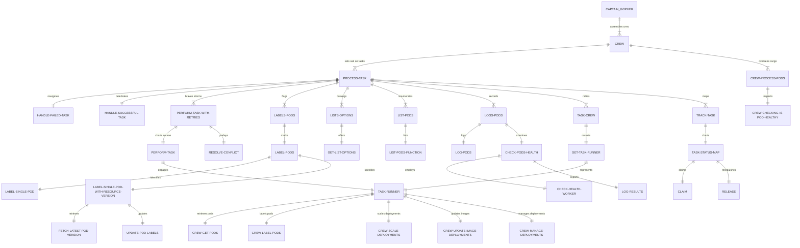

<p align="center">
  
  
</p>

<p align="center">
  <em>Pic found in <a href="https://www.reddit.com/r/golang_id">reddit</a> & Searching</em>
</p>

# K8sBlackPearl 🏴‍☠️

[](https://goreportcard.com/report/github.com/H0llyW00dzZ/K8sBlackPearl)
[](https://pkg.go.dev/github.com/H0llyW00dzZ/K8sBlackPearl)

### Shall We have Drink ?

This repository is the continuation of development from [`WorkerK8S`](https://pkg.go.dev/github.com/H0llyW00dzZ/go-urlshortner@v0.4.10/workerk8s), developed by the best Go programmers.

### Reason for Continuation

In real-world applications, the complexity and cost can escalate quickly. `K8sBlackPearl` was created as an in-house solution, written in Go, to streamline Kubernetes management and reduce operational expenses. Building on the foundation of `WorkerK8S`, aiming to provide a more efficient and cost-effective tool, with a simplified interface for Kubernetes cluster management.

### Example Configuration Tasks

#### JSON:

```json
[
    {
        "name": "list-specific-pods",
        "shipsNamespace": "BlackPearl",
        "type": "GetPods",
        "parameters": {
            "labelSelector": "app=nginx",
            "fieldSelector": "status.phase=Running",
            "limit": 10
        }
    },
	{
        "name": "list-specific-pods-run",
        "shipsNamespace": "BlackPearl",
        "type": "CrewGetPodsTaskRunner",
        "parameters": {
            "labelSelector": "app=nginx",
            "fieldSelector": "status.phase=Running",
            "limit": 10
        }
    },
	{
        "name": "check-health-pods",
        "shipsNamespace": "BlackPearl",
        "type": "CrewCheckHealthPods",
        "parameters": {
            "labelSelector": "app=nginx",
            "fieldSelector": "status.phase=Running",
            "limit": 10
        }
    },
    {
        "name": "label-all-pods",
        "shipsNamespace": "BlackPearl",
        "type": "CrewWriteLabelPods",
        "parameters": {
            "labelKey": "environment",
            "labelValue": "production"
        }
    },
    {
        "name": "update-specific-pod",
        "shipsNamespace": "BlackPearl",
        "type": "CrewWriteLabelPods",
        "parameters": {
            "podName": "pod-name",
            "labelKey": "environment",
            "labelValue": "production"
        }
    }
]
```

#### YAML:
```yaml
- name: "list-specific-pods"
  shipsNamespace: "BlackPearl"
  type: "GetPods"
  parameters:
    labelSelector: "app=nginx"
    fieldSelector: "status.phase=Running"
    limit: 10

- name: "list-specific-pods-run"
  shipsNamespace: "BlackPearl"
  type: "CrewGetPodsTaskRunner"
  parameters:
    labelSelector: "app=nginx"
    fieldSelector: "status.phase=Running"
    limit: 10

- name: "check-health-pods"
  shipsNamespace: "BlackPearl"
  type: "CrewCheckHealthPods"
  parameters:
    labelSelector: "app=nginx"
    fieldSelector: "status.phase=Running"
    limit: 10

- name: "label-all-pods"
  shipsNamespace: "BlackPearl"
  type: "CrewWriteLabelPods"
  parameters:
    labelKey: "environment"
    labelValue: "production"

- name: "update-specific-pod"
  shipsNamespace: "BlackPearl"
  type: "CrewWriteLabelPods"
  parameters:
    podName: "pod-name"
    labelKey: "environment"
    labelValue: "production"

```

> [!NOTE]  
> Support Multiple-Task and a lot's of worker

> [!TIP]
> The `Support Multiple-Task and a lot's of worker` can automatically scale up by spawning a significant number of workers, as enabled by the automated scalability feature after the [`Enhancement`](https://github.com/H0llyW00dzZ/K8sBlackPearl/pull/23).
> It has been tested with 100 workers operating across 70 pods, including robust error handling, and has demonstrated stable performance without any bottlenecks.
> Initially, the CPU consumption is only about 10% on average, which then automatically reduces over time.

#### Example:

```go
package main

import (
	"context"
	"fmt"
	"os"
	"os/signal"
	"sync"
	"syscall"

	"github.com/H0llyW00dzZ/K8sBlackPearl/navigator"
	"github.com/H0llyW00dzZ/K8sBlackPearl/worker"
	"go.uber.org/zap"
)

func main() {
	filePath := "test.json" // Replace with the actual path to your task configuration file
	// Initialize the logger.
	logger, err := zap.NewDevelopment() // Use NewProduction for a sensible default
	if err != nil {
		fmt.Printf("Failed to initialize logger: %v\n", err)
		os.Exit(1)
	}
	defer logger.Sync() // Flushes buffer, if any

	sugar := logger.Sugar()

	// Assuming navigator has a SetLogger function to initialize the logger.
	navigator.SetLogger(logger)

	// Set up a context that we can cancel in order to shut down the processes gracefully.
	ctx, cancel := context.WithCancel(context.Background())
	defer cancel()

	// Handle SIGINT and SIGTERM for graceful shutdown.
	signals := make(chan os.Signal, 1)
	signal.Notify(signals, syscall.SIGINT, syscall.SIGTERM)

	// Initialize Kubernetes client.
	clientset, err := worker.NewKubernetesClient()
	if err != nil {
		sugar.Errorf("Failed to create Kubernetes client: %v", err)
		os.Exit(1)
	}

	// Define the namespace and number of workers.
	workerCount := 1 // Number of workers you want to start

	tasks, err := worker.InitializeTasks(filePath)
	if err != nil {
		sugar.Fatalf("Failed to initialize tasks: %v", err)
	}

	// Start workers.
	var wg sync.WaitGroup
	wg.Add(1)
	results, shutdown := worker.CaptainTellWorkers(ctx, clientset, tasks, workerCount)

	go func() {
		defer wg.Done()
		for result := range results {
			sugar.Infof("Received result: %v", result)
		}
	}()

	// Wait for interrupt signal for graceful shutdown.
	<-signals
	sugar.Info("Shutdown signal received")

	// Call the shutdown function to stop all workers.
	shutdown()

	// Wait for all goroutines to finish.
	wg.Wait()
	sugar.Info("All workers have been shut down. Exiting.")
}

```
> [!WARNING]
> When using multiple workers, ensure that each task has a unique name. This is important for proper concurrency control since this best tools/stuff using goroutines alongside sync.Mutex and dependency injection. If all tasks have the same name, regardless of the number of workers configured (e.g, you use 1337 worker), only one goroutine may be spawned due to name confusion in task management (`track_task.go`).


# Additonal Note

> [!NOTE]  
> This still development, there is no configuration/setup, or docs for how to run it unless you are expert in GO.

> [!TIP]
> The Navigator package (`Dependency Injection`), now includes support for `zap.NewProduction()`. This enhancement showcases one of the strengths of the Go programming language. In contrast, dependency injection is often more challenging to implement in other programming languages, so yeah get good get golang.

# TODO

## 🏴‍☠️ Advanced Dependency Injection Clarity
- [x] **Dependency Injection Implementation**: Confirmed the implementation of Dependency Injection (DI) across the system, providing flexibility and improving testability.
  - Verified that Kubernetes ClientSet is passed as a parameter to functions, allowing for easy replacement during testing.
  - Ensured that the `TaskRunner` interface and its registry pattern are used to inject task-specific logic, promoting loose coupling and easy extension.
  - Checked that `zap.Logger` instances are passed to functions requiring logging capabilities, which enables custom logger configurations for different environments.
  - Confirmed that `context.Context` is passed through functions to manage cancellation and timeouts, allowing the caller to control the behavior of the function execution.

> [!NOTE]
> This specialized feature has been successfully integrated.

## CrewWorker Function Improvements
- [x] **Error Handling and Retry Logic**: Successfully integrated error handling and retry mechanisms within the `CrewWorker` function to manage transient errors gracefully.

- [ ] **Function Versatility and Configurability**: 
  - ~~Enhance the versatility of the `CrewWorker` function. It currently processes tasks in a generic manner, but it could be extended to handle a wider variety of tasks with different complexities.~~
  - ~~Improve the configurability of task processing. The `CrewGetPodsTaskRunner.Run` method is specialized in listing pods; however, it should be adaptable to accommodate different parameters and settings for various task types.~~
  - Plan to enhance the versatility of the `CrewWorker` function to handle tasks with varying complexities, not limited to pod health checks.
  - Aim to improve the configurability of task processing to allow `CrewWorker` and other related functions to accommodate different parameters and settings for a variety of task types.

## Structured Logging Integration
- [x] **Structured Logging**: Integrated structured logging throughout the package, providing clear and consistent logs with additional context for debugging.

## Task Execution Model
- [x] **Dynamic Task Execution Model**: Implemented a dynamic task execution model that allows for registering and retrieving `TaskRunner` implementations based on task types, enhancing extensibility.
- [x] **Multi-Namespace Support**: [`Enhanced`](https://github.com/H0llyW00dzZ/K8sBlackPearl/pull/37) the task execution model to support multiple namespaces, allowing `CrewWorker` to operate across various Kubernetes namespaces and expand its operational range.
- [x] **Retry Logic Policy**: Introduced an advanced retry logic policy that adapts to different kinds of errors and conditions, further improving the robustness and reliability of task execution.


> [!NOTE]
> This specialized feature has been successfully integrated.

## Load Configuration Task
- [x] **Load Configuration**: Enhanced the application to load task configurations from a YAML file, improving ease of use and configurability.

## Pod Labeling Logic Enhancement
- [x] **Optimized Pod Labeling**:
  - Implemented an optimized pod labeling process that checks existing labels and updates them only if necessary, reducing the number of API calls and improving overall performance.
  - Integrated retry logic specific to pod labeling to handle intermittent API errors efficiently.

## Package Extension
- [ ] **Support for Additional Kubernetes Resources**:
  - Develop the capability to manage and interact with a broader range of Kubernetes resources, including services, deployments, and stateful sets.
  - Plan to implement operations that cater to specific resource requirements, enabling a more comprehensive management toolset within the Kubernetes ecosystem.

## Monitoring and Metrics
- [ ] **Metrics Collection Framework**:
  - Design and integrate a metrics collection system to monitor the health and efficiency of the worker processes.
  - Metrics should provide insights into the success rates of tasks, resource usage, processing times, and error rates.
  - Explore the possibility of leveraging existing monitoring tools that can be integrated with Kubernetes for streamlined metrics collection and visualization.

## High-Level and Low-Level Operations

In our Kubernetes task management system, we've designed a robust framework that intertwines high-level abstractions with low-level operations to provide a comprehensive solution for orchestrating and executing tasks within a Kubernetes environment.

### High-Level Operations

High-level operations in our system refer to the overarching functionalities and abstractions that simplify complex processes into manageable components. These operations serve as the backbone of our system, providing users with a user-friendly interface and abstracting away the intricacies of direct Kubernetes interactions.

- **Task Abstraction**: We define tasks through the `Task` struct, which represents a unit of work with a unique name, type, and parameters, abstracting the details of the specific work to be done.
- **Task Management Workflow**: Our `CaptainTellWorkers` function sets up a fleet of worker goroutines that operate concurrently, managing the lifecycle and execution flow of tasks in a distributed manner.
- **Configuration Management**: The system allows for the configuration of tasks through JSON and YAML files, enabling users to define and modify task parameters easily.

### Low-Level Operations

Low-level operations are the nuts and bolts of our system. They handle the direct interaction with Kubernetes resources, managing the specific details of API requests, error handling, and resource manipulation.

- **Direct Kubernetes API Interactions**: Functions like `labelSinglePodWithResourceVersion` and `ScaleDeployment` interact directly with Kubernetes resources, handling the specifics of creating, updating, and managing Kubernetes objects.
- **Detailed Error Handling**: Our system includes comprehensive error handling and logging mechanisms, such as in `error_and_retry.go`, ensuring that all potential issues are caught and appropriately managed.
- **Retry Logic and Conflict Resolution**: The system implements retry logic in operations like `update_image.go`, which is crucial for dealing with transient errors and conflicts that can occur in a dynamic Kubernetes environment.

### Integration of High-Level and Low-Level Operations

Our system seamlessly integrates high-level and low-level operations to deliver a robust and efficient task management solution. By combining these two operational layers, we provide users with a powerful toolset that is both easy to use and capable of handling the complexities of Kubernetes resource management.

- [x] **High-Level Abstractions**: The system's high-level abstractions empower users to define and manage tasks without needing to understand the underlying Kubernetes API complexities.
- [x] **Low-Level Directives**: The low-level operations provide the necessary control and precision required for granular management of Kubernetes resources, ensuring that the system can handle a wide range of scenarios with reliability and accuracy.

Our continued development efforts aim to enhance these operations further, ensuring that our system remains at the forefront of Kubernetes task management solutions.

# How it work ?


